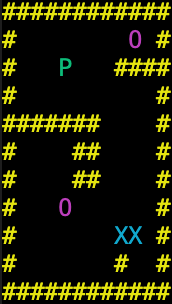

<!-- PROJECT LOGO -->
<br />
<p align="center">
  <a href="https://github.com/nicklamyeeman/my_sokoban">
    
  </a>

  <h3 align="center">SOKOBAN</h3>

  <p align="center">
    Play the japanese game in your Terminal
    <br />
    <a href="https://github.com/nicklamyeeman/my_sokoban"><strong>Explore the docs »</strong></a>
    <br />
    <br />
    <a href="https://github.com/nicklamyeeman/my_sokoban/issues">Report Bug</a>
    ·
    <a href="https://github.com/nicklamyeeman/my_sokoban/issues">Request Feature</a>
  </p>
</p>


<!-- TABLE OF CONTENTS -->
## Table of Contents

* [About the Project](#about-the-project)
  * [Built With](#built-with)
* [Getting Started](#getting-started)
  * [Prerequisites](#prerequisites)
  * [Installation](#installation)
* [Usage](#usage)
* [Roadmap](#roadmap)
* [Contributing](#contributing)
* [Contact](#contact)
* [Acknowledgements](#acknowledgements)


<!-- ABOUT THE PROJECT -->
## About The Project

This project is a school project of the Epitech school. The goal is to recreate the famous Japanese game of the same name: Sokoban.
The player "P" has to move all the boxes "X" on the "O" locations. Once all the "O" places are replaced by the "X" places, the level is finished and validated.
11 levels are available !

### Built With

* [Ncurses](https://invisible-island.net/ncurses/announce.html)


<!-- GETTING STARTED -->
## Getting Started

To get a local copy up and running follow these simple steps.

### Prerequisites

Be sure you have Ncurses installed on your PC, then open a terminal

### Installation

1. Clone the repo
```sh
git clone https://github.com/nicklamyeeman/my_sokoban.git
```
2. Compile it
```sh
make
```


<!-- USAGE -->
## Usage

### Example

```sh
./my_sokoban
```

Menu page:
<br/>


You can navigate throught the menu with the arrow keys <kbd>↑</kbd> & <kbd>↓</kbd> and start any level with <kbd>Space</kbd>

The ascii menu is available at ``` config/menu ```



Each original level is harder than the previous one.
You can use <kbd>Space</kbd> to restart the level your currently trying to solve


But you can add any map in the ``` map/ ``` folder without modifying anything

### BE CAREFUL
Use <kbd>ESC</kbd> in any level to back in the menu and in the menu to quit the game.


<!-- ROADMAP -->
## Roadmap

See the [open issues](https://github.com/nicklamyeeman/my_sokoban/issues) for a list of proposed features (and known issues).


<!-- CONTRIBUTING -->
## Contributing

Contributions are what make the open source community such an amazing place to be learn, inspire, and create. Any contributions you make are **greatly appreciated**.

1. Fork the Project
2. Create your Feature Branch (`git checkout -b feature/AmazingFeature`)
3. Commit your Changes (`git commit -m 'Add some AmazingFeature'`)
4. Push to the Branch (`git push origin feature/AmazingFeature`)
5. Open a Pull Request


<!-- CONTACT -->
## Contact

Nick LAM YEE MAN - [@nickauteen](https://twitter.com/nickauteen) - nick.lam-yee-man@epitech.eu

Project Link: [https://github.com/nicklamyeeman/my_sokoban](https://github.com/nicklamyeeman/my_sokoban)


<!-- ACKNOWLEDGEMENTS -->
## Acknowledgements

* [Best-README Template](https://github.com/othneildrew/Best-README-Template)


<!-- MARKDOWN LINKS & IMAGES -->
<!-- https://www.markdownguide.org/basic-syntax/#reference-style-links -->
[contributors-shield]: https://img.shields.io/github/contributors/nicklamyeeman/repo.svg?style=flat-square
[contributors-url]: https://github.com/nicklamyeeman/repo/graphs/contributors
[forks-shield]: https://img.shields.io/github/forks/nicklamyeeman/repo.svg?style=flat-square
[forks-url]: https://github.com/nicklamyeeman/repo/network/members
[stars-shield]: https://img.shields.io/github/stars/nicklamyeeman/repo.svg?style=flat-square
[stars-url]: https://github.com/nicklamyeeman/repo/stargazers
[issues-shield]: https://img.shields.io/github/issues/nicklamyeeman/repo.svg?style=flat-square
[issues-url]: https://github.com/nicklamyeeman/repo/issues
[license-shield]: https://img.shields.io/github/license/nicklamyeeman/repo.svg?style=flat-square
[license-url]: https://github.com/nicklamyeeman/repo/blob/master/LICENSE.txt
[linkedin-shield]: https://img.shields.io/badge/-LinkedIn-black.svg?style=flat-square&logo=linkedin&colorB=555
[linkedin-url]: https://linkedin.com/in/nicklamyeeman
[product-screenshot]: images/screenshot.png
